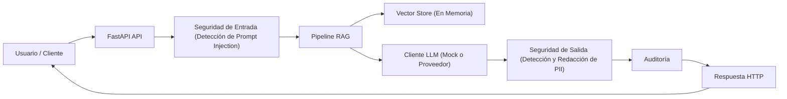
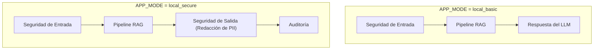
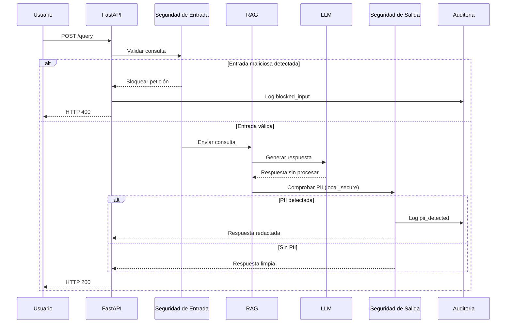

# Secure RAG from Scratch – Documentación Técnica

## Arquitectura de Alto Nivel

Cliente → FastAPI → Seguridad de Entrada → Pipeline RAG → Seguridad de Salida → Auditoría → Respuesta

---

## Modos de Ejecución (APP_MODE)

El sistema permite un **endurecimiento progresivo de la seguridad** mediante modos de ejecución.

---

## Flujo de Seguridad (Detallado)

---

## Notas

- Los controles de seguridad están **fuera del LLM**.
- La auditoría forma parte del diseño, no es opcional.
- Este README puede subirse directamente a GitHub sin modificaciones.
