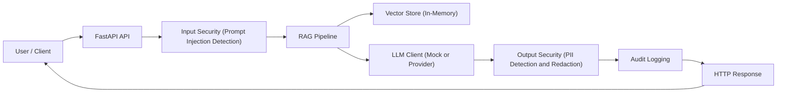
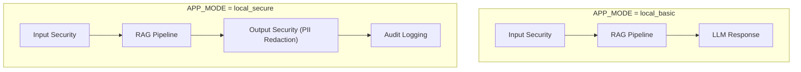
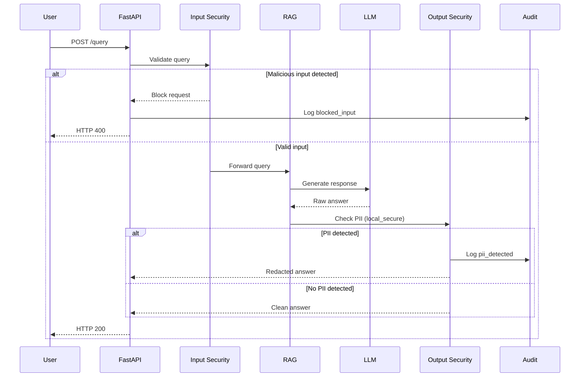

# Secure RAG from Scratch – Technical Documentation

## High-level Architecture

Client → FastAPI → Input Security → RAG Pipeline → Output Security → Audit → Response

---

## Execution Modes (APP_MODE)

The system supports progressive security hardening using execution modes.

---

## Security Flow (Detailed)

---

## Notes

- Security controls are external to the LLM.
- Mermaid blocks are isolated and closed correctly.
- This README can be uploaded directly to GitHub without editing.
